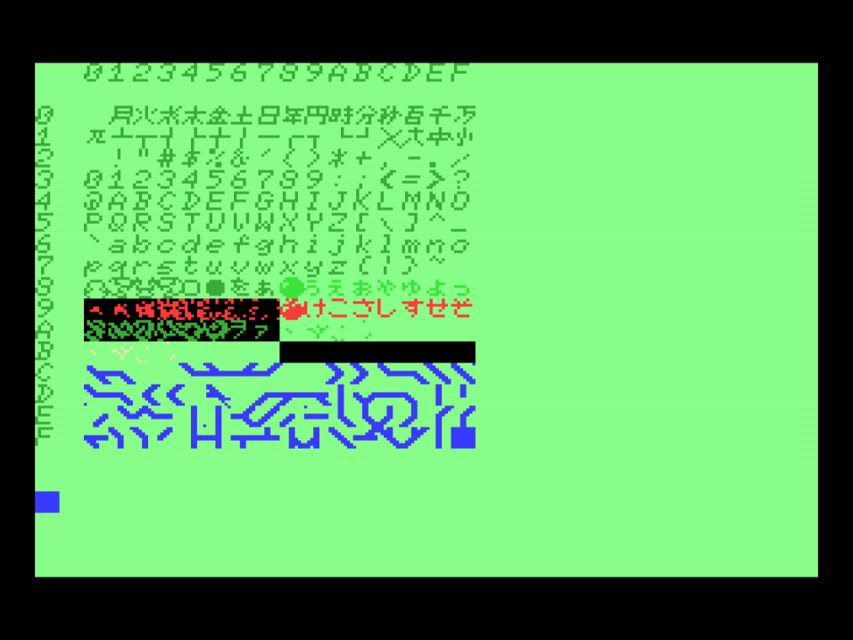

# Programando em C e ASM para MSX usando Visual Studio e Fusion-C
# Sessão 11: Gráficos!

Escrito por **Danilo Angelo (a.k.a. Damned Angel)**, 2020-2021

Vídeo da sessão 11: XXX

Canal **8-bit Saga**: https://www.youtube.com/channel/UC-QPKENS07P_5q-7a7ps2HA

Discord server **MSX Revamp**: https://discord.gg/f3HDgfXKxE

Templates de projetos MSX: https://github.com/DamnedAngel/MSX-Templates-for-VisualStudio/releases

---

## Nota do autor

__A participação no workshop, bem como a utilização dos materiais associados, é livre e gratuita. 
No entanto, vale lembrar que a preparação das sessões, o desenvolvimento e a manutenção dos templates, a escrita dos programas de exemplo, a preparação da infra-estrutura e edição dos vídeos consomem tempo e recursos razoáveis.
Se você quiser reconhecer esse trabalho e prestigiar a iniciativa, faça sua colaboração através de uma das plataformas abaixo:__

* BuyMeACoffe: https://www.buymeacoffee.com/DamnedAngel​
* PayPal: danilo@angelo.eng.br
* Pix: danilo@angelo.eng.br

**Long live MSX!**

---

## Abreviações usadas nesse documento

VS: Visual Studio 2019

---

## Padronizações usadas nesse documento

Esse documento é dividido em sessões de workshop, e as sessões são divididas em tópicos de estudo.

Os tópicos de estudo são dividos em passos. Esses passos terão sempre 1 dentre 3 formatos:
* Um passo com o verbo no gerúndio (ex: *Compilando o projeto.*) significa uma exposição do palestrante (assista o vídeo no YouTube com a exposição em XXX)
* Um passo com o verbo no imperativo (ex: *Configure a aplicação*) denota um passo para ser executado pelo participante.
* Um passo com a descrição de uma atividade (ex: *Discussão em grupo.*) descreve a proposta de uma dinâmica.

Adicionalmente, note que os trechos de código fornecidos como exemplo muitas vezes contém um trecho já existente do programa, para referência de localização.

---

# Sessão 11: Gráficos!

### 11.1. Construindo um mapa de caracteres em modo debug.
###### *Github Ticket/Branch: 43/TKT0043.*

##### Objetivo: Ter uma ferramenta para visualizar e acompanhar a criação dos gráficos do jogo (previsão: 15 minutos).

1. Relembrando os perfis de compilação DEBUG e RELEASE.
- Diretivas de compilação.
- Linha de comando para compilação do projeto.
- A variável *DEBUG* nos arquivos TargetConfig_*.txt.
- A diretiva DEBUG em targetconfig.s e targetconfig.h.
- O *#include targetconfig.h* no arquivo msxromapp.c.
- *#ifdef* e *#endif*. 

2. Compile o projeto tanto em modo DEBUG quanto em modo RELEASE e garanta que ambos os perfis estão funcionando, testando o executável gerado no emulador.

3. **DESAFIO**: Sem olhar a resposta abaixo e com base na discussão sobre diretivas de compilação, implemente a função *charMap()* que mostra um mapa com os 256 caracteres (tiles/padrões) da screen 1 e a chame da função *main()* após a inicialização de vídeo. Tanto a função quanto a chamada a ela só deverão ser inclusas no executável quando o projeto for compilado em modo DEBUG.

```c
*** Resposta ao desafio somente no roteiro pós-sessão. ***
```

4. Compile e execute o programa em modo DEBUG. O mapa de caracteres foi mostrado?

5. Compile e execute o programa em modo RELEASE. O mapa de caracteres foi mostrado?

### 11.2. Desenhando o tile da maçã.
###### *Github Ticket/Branch: 35/TKT0035.*

##### Objetivo: importar o template de tiles para o projeto e substituir o caracter '#' por um desenho de maçã (previsão: 45 minutos).

1. Lembrando da tabela de padrões do VDP.
- Mapa de caracteres da implementação de referência do jogo.



2. Mova o arquivo de template de tiles, já preenchido, para a pasta do projeto.

3. Renomeie o arquivo para tiles.h.

4. Se você usa Visual Studio, adicione-o arquivo ao projeto, sob o filtro *Header Files*.

5. Embora não corramos o risco no nosso projeto, como boa prática, garanta que o arquivo não incorrerá em definições duplicadas caso seja referenciado por múltiplos arquivos fonte do projeto, inserindo na primeira linha:
```c
#pragma once
```

6. **DESAFIO**: Sem olhar a resposta abaixo, referencie o arquivo tiles.h no arquivo principal do nosso programa msxromapp.c.

```c
*** Resposta ao desafio somente no roteiro pós-sessão. ***
```

7. Compile o projeto para garantir que o arquivo tiles.h está ok. Corrija qualquer problema de sintaxe que existir, se existir.

8. Refactoring: migre as definições de códigos de tiles do arquivo msxromapp.c para o início do arquivo tiles.h.

```c
#pragma once

#define TILE_GRASS		' '
#define TILE_SNAKETAIL		'o'
#define TILE_SNAKEHEAD		'*'
#define TILE_APPLE		'#'
```

9. Com base no mapa de caracteres de referência, altere a constante *TILE_APPLE* para o valor final. Se quiser, rode o programa para vê-lo funcionando com um caracter diferente representando a maçã.

```c
#define TILE_APPLE		0x98
```

10. **DESAFIO**: Sem olhar a resposta abaixo, crie a função *blockToVRAM(VRAMAddr, RAMAddr, blockLength)* para tranferir um bloco de dados da RAM para a VRAM.

```c
*** Resposta ao desafio somente no roteiro pós-sessão. ***
``` 

11. **DESAFIO**: Sem olhar a resposta abaixo, crie a função *buildTiles()* e insira nela uma linha para montar o tile da maçã na VRAM usando a função *blockToVRAM*.

```c
*** Resposta ao desafio somente no roteiro pós-sessão. ***
```

12. **DESAFIO**: Chame a função *buildTiles()* a partir da função *main()*, após inicializar o modo de vídeo, mas antes da chamada à função *charMap()*.

```c
*** Resposta ao desafio somente no roteiro pós-sessão. ***
``` 

13. Compile e rode o programa. A maçã apareceu no mapa de caracteres? E no jogo?

### 11.3. Montando os outros tiles do jogo.
###### *Github Ticket/Branch: 45/TKT0045.*

##### Objetivo: Montar os demais tiles do jogo (previsão: 15 minutos).

1. **DESAFIO**: Sem olhar a resposta abaixo, repita os passos 9 e 11 para cada grupo de tiles definido no arquivo tiles.h.

```c
*** Resposta ao desafio somente no roteiro pós-sessão. ***
```

2. Compile e rode o programa. O mapa de caracteres foi atualizado? O que aconteceu com o jogo? Por quê?

3. Corrija temporariamente o problema, alterando o endereço VRAM dos tiles de grama para o código original, de espaço:

```c
#define TILE_GRASS		' '
```

4. Compile e rode o programa. Note a nova posição, temporária, dos tiles de grama. O jogo funcionou? O que está estranho?

### 11.4. Olha pra frente!
###### *Github Ticket/Branch: 46/TKT0046.*

##### Objetivo: Fazer a cobra olhar sempre para frente (previsão: 5 minutos).

1. **DESAFIO**: Sem olhar a resposta abaixo, selecione o tile correto da cabeça da cobra, em função da direção, em cada movimento.

```c
*** Resposta ao desafio somente no roteiro pós-sessão. ***
```

2. Compile e rode o programa.

### 11.5. Tile de colisão.
###### *Github Ticket/Branch: 46/TKT0046.*

##### Objetivo: Mostrar um tile de explosão da cabeça no evento da colisão (previsão: 5 minutos).

1. **DESAFIO**: Sem olhar a resposta abaixo, selecione um dos tiles da animação de explosão da cabeça quando acontecer uma colisão.

```c
*** Resposta ao desafio somente no roteiro pós-sessão. ***
```

2. Compile e rode o programa.


### 11.6. Finalização da Sessão 10
##### Objetivo: Discutir os tópicos tratados e o modelo/dinâmica do workshop (previsão: 10 minutos).

1. Lição de casa: colorir o jogo e a tela de abertura (na sessão que vem eu passarei a minha solução, mas seria bacana se cada um tivesse a sua).

2. Discussão geral da apresentação:
* Comentários sobre o estado corrente do jogo
* VDP / Tabela de padrões
* Arquivos header
* Dinâmica geral do workshop: feedbacks e ideias.

---

**Happy MSX'ing.**
